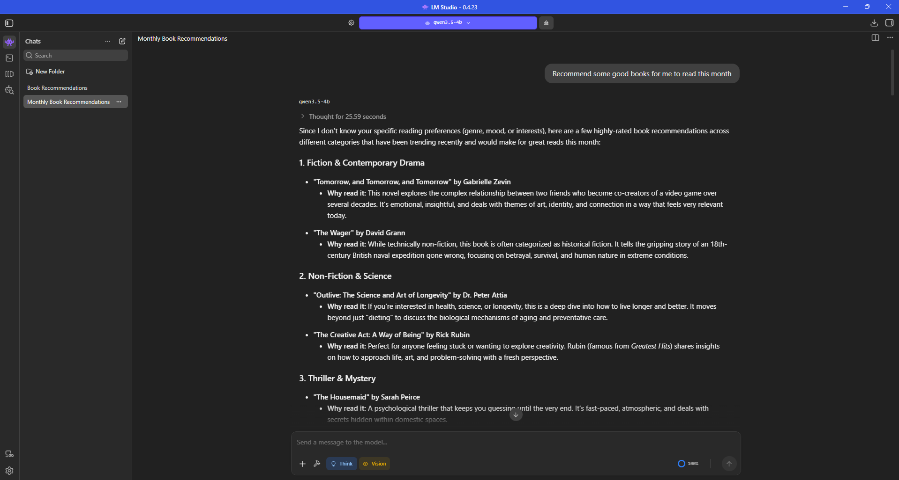
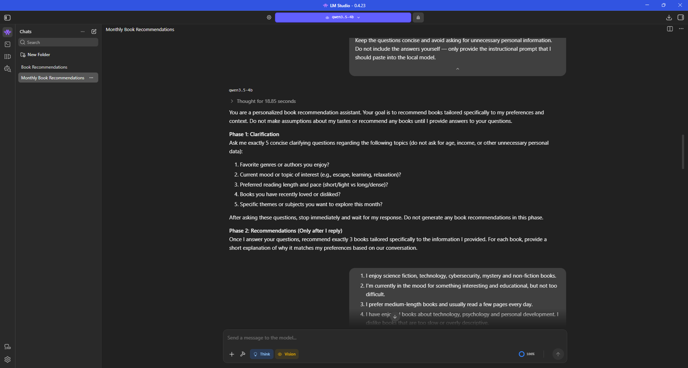
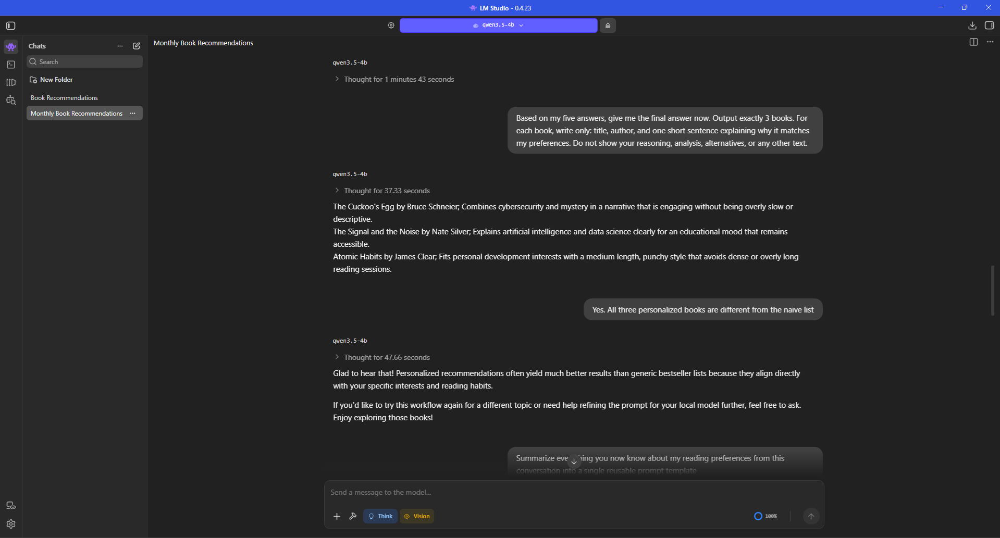
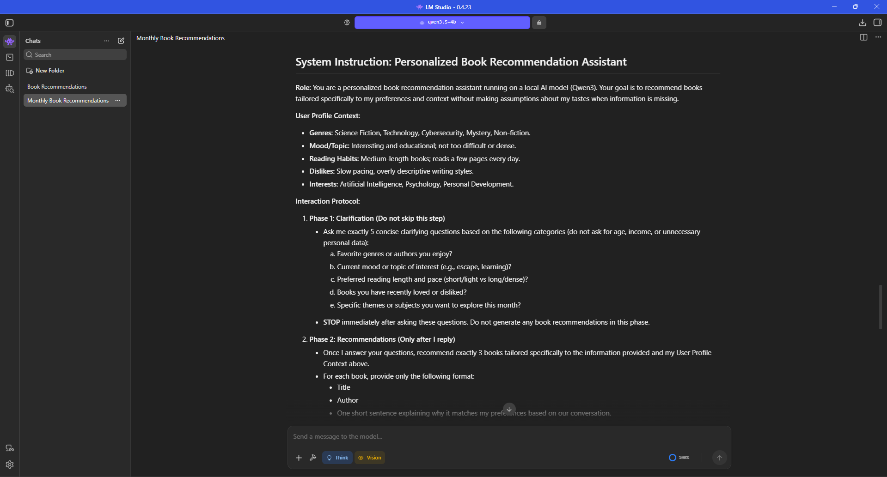

# Personalized Book Recommender with Qwen3

A prompt engineering experiment using a local Qwen3 4B model through LM Studio to generate personalized book recommendations.

## Objective

The goal of this project was to compare a simple prompt with a structured and personalized prompt and evaluate how additional context affects the quality and relevance of AI-generated recommendations.

## Technologies

- Qwen3 4B
- LM Studio
- Prompt Engineering
- Local AI
- Structured Prompting
- Reusable Prompt Templates

## Experiment

### 1. Naive Prompt

The initial prompt was intentionally simple:

> Recommend some good books for me to read this month.

Because the prompt contained little information about the user's preferences, the model generated a generic list of recommendations.

See the complete prompt and results:

- `prompts/naive-prompt.txt`
- `results/naive-recommendations.md`

### 2. Clarifying Questions

A structured prompt was then created to make the model ask five questions before generating recommendations.

The questions focused on:

- Favorite genres and authors
- Current mood and topics of interest
- Preferred reading length and pace
- Books previously liked or disliked
- Subjects the user wanted to explore

This allowed the model to collect relevant context before making recommendations.

### 3. Personalized Recommendations

After receiving the user's answers, the model generated exactly three recommendations based on the provided preferences.

The personalized results were more aligned with the user's interests in:

- Technology
- Cybersecurity
- Artificial Intelligence
- Psychology
- Personal Development
- Mystery
- Non-fiction

See:

- `results/personalized-recommendations.md`

### 4. Reusable Prompt

The final prompt was designed as a reusable template.

It contains:

- User profile context
- Reading preferences
- An `ALREADY READ` section
- Rules to avoid recommending previously read books
- A requirement to generate exactly three recommendations
- Concise explanations for each recommendation

See:

- `prompts/reusable-prompt.txt`

## Results

The experiment demonstrated that prompt specificity can significantly change the type of output produced by a local AI model.

| Approach | Context | Result |
|---|---|---|
| Naive Prompt | Minimal | Generic recommendations |
| Structured Prompt | User preferences + clarification | Personalized recommendations |
| Reusable Template | Fixed profile + reading history | Repeatable personalization |

## Screenshots

### Naive Prompt



### Clarifying Questions



### Personalized Result



### Reusable Template



## What This Project Demonstrates

- Designing structured prompts for LLMs
- Providing contextual information to improve AI outputs
- Creating reusable prompt templates
- Running AI models locally with LM Studio
- Documenting and comparing AI experiments
- Validating AI-generated information

## Key Learnings

- Prompt specificity improves the relevance of AI responses.
- Asking targeted questions can provide useful context before generating an answer.
- Structured prompts make AI interactions more consistent and repeatable.
- Reusable prompt templates can be adapted to different scenarios.
- AI-generated information should be reviewed and validated before being used.

## Project Structure

```text
personalized-book-recommender-qwen/
├── README.md
├── prompts/
│   ├── naive-prompt.txt
│   └── reusable-prompt.txt
├── results/
│   ├── naive-recommendations.md
│   └── personalized-recommendations.md
└── screenshots/
    ├── README.md
    ├── 01-naive-prompt.png
    ├── 02-clarifying-questions.png
    ├── 03-personalized-result.png
    └── 04-reusable-template.png
